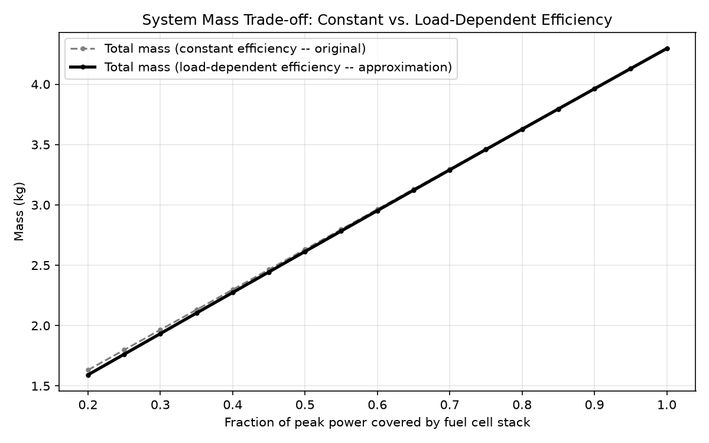
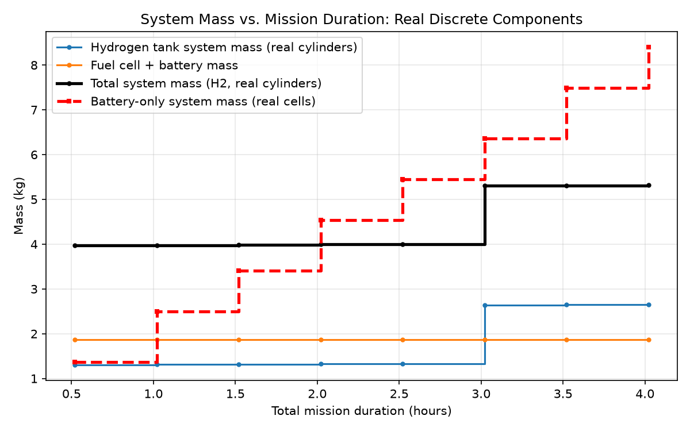

# Fuel Cell System Sizing Tool

A first-order sizing tool for hydrogen fuel cell propulsion systems. Given a mission's power and energy requirements, it sizes the fuel cell stack, battery buffer, and hydrogen tank — and shows where the mass trade-offs actually lie, including a direct comparison against a battery-only system.

## Why this matters

Hydrogen fuel cells are often pitched as the answer to battery range limits in aviation and long-duration mobility applications, but *when* that's actually true depends on mission length, power profile, and component choices. This tool makes those trade-offs visible and quantifiable, rather than just asserting "hydrogen is better for long range."

## How it works

**1. Define a mission profile** (`src/mission_profile.py`)
A mission is modeled as a sequence of phases (e.g. takeoff, climb, cruise, descent, landing), each with a duration and power demand. From this, the tool derives total energy required and peak power demand.

**2. Size the system** (`src/fuel_cell_sizing.py`)

- **Fuel cell stack**: sized to cover a chosen fraction of peak power continuously (stacks respond too slowly for sudden spikes)
- **Battery buffer**: covers the remaining power gap during short peak-demand phases like takeoff
- **Hydrogen tank**: sized by total mission energy, accounting for realistic tank structure mass, not just the hydrogen itself
- **Battery-only comparison**: sizes an equivalent pure-battery system for the same mission, for direct comparison

**3. Size against real components** (`src/fuel_cell_profiles.py`, `src/battery_profiles.py`, `src/cylinder_profiles.py`, `src/compare_fuel_cells.py`)
Real manufacturer datasheet specs for candidate fuel cells (Horizon FCS-UL500, Intelligent Energy S800, Horizon UL-1000), battery cells, and composite hydrogen cylinders replace the generic specific-power/energy assumptions, and check each design against a real product's rated power limit and a mass budget.

**4. Explore trade-offs** (`src/plot_results.py`, `src/nonlinear_tradeoffs.py`)
Two sweeps are run automatically:

- How total system mass splits between fuel cell stack and battery buffer, as the stack sizing choice changes
- How total system mass scales with mission duration, for both the hydrogen system and a battery-only equivalent

`nonlinear_tradeoffs.py` re-runs both sweeps with more physically realistic assumptions instead of the constant-ratio scaling above: fuel cell efficiency as a function of load (approximate, since full polarization-curve data isn't published for these products), and hydrogen tank / battery-only mass computed against real, discrete cylinder and cell counts instead of smooth generic formulas.

**5. Size for fuel cell failure, not just normal operation** (`src/emergency_battery_sizing.py`)
Everything above assumes the fuel cell keeps working — the battery buffer is only sized to smooth short peaks. This module asks the safety-critical question instead: if the fuel cell fails completely mid-flight, can the buffer battery alone supply enough power and energy to fly an emergency climb/go-around and landing sequence? It checks real battery cells against both the power and energy demands of that contingency, and flags whether a normal-duty buffer pick would actually survive a real failure.

## Results

For an example long-range UAV mission (3.3 hours total, 4kW peak power at takeoff):

**Stack sizing trade-off**: a smaller fuel cell stack paired with a larger battery buffer produces the lightest overall system for this mission — because batteries have much higher specific power (W/kg) than fuel cell stacks, even though fuel cells win on energy density.

**Mission duration scaling**: this is the core insight. Fuel cell + battery mass stays flat regardless of mission duration (it's sized only by peak power), while hydrogen tank mass grows with mission length — but far more slowly than an equivalent battery-only system, whose mass is directly capped by battery specific energy (~200 Wh/kg vs. hydrogen's ~33,000 Wh/kg).

For this mission profile, the hydrogen system's mass advantage over a battery-only system grows substantially as mission duration increases — the crossover point and growing gap are visible directly in the plot.

**Is the trade-off actually linear?** The two plots above use constant-ratio assumptions (fixed specific power/energy/efficiency), so they come out as straight lines by construction. Re-running both sweeps with more realistic assumptions shows where that holds up and where it doesn't:

Fuel cell efficiency does drop as load increases (PEM polarization losses), but the total mass curve barely bends — because the hydrogen tank (the only component affected by efficiency) is a small fraction of total mass here. The stack and battery, which dominate total mass, scale linearly by design regardless.

Swapping the smooth generic tank/battery formulas for real, discrete cylinder and cell counts shows genuine non-linearity — total mass jumps in steps as mission duration crosses the point where another whole cylinder or battery cell is needed, rather than growing smoothly.

**Fuel-cell-failure contingency**: none of the normal-duty buffer picks (sized only for short-peak smoothing) survive a full fuel cell failure — each needs roughly double the cell count to independently cover an emergency climb-and-land sequence. The added mass (0.15–0.31 kg depending on config) still fits within the original mass budget.

## What I'd improve with more time

- Track battery state-of-charge through the full mission, so the fuel-cell-failure contingency sizing accounts for a partially-depleted buffer at the moment of failure, not just a fresh pack
- Add balance-of-plant mass (compressors, humidifiers, cooling) more rigorously across all fuel cell candidates
- Validate hydrogen tank gravimetric fraction assumption against a wider range of real Type III/IV composite tank data
- Extend mission profiles to support variable/continuous power curves instead of discrete phases
- Fit the load-dependent efficiency approximation against real polarization-curve test data, if it becomes available, instead of the current illustrative curve
- Connect this to the [Battery-SOC-estimator](https://github.com/pranav-shivaprakash/Battery-SOC-estimator) repo's SOH model, to account for battery degradation over the system's operational life

## Setup