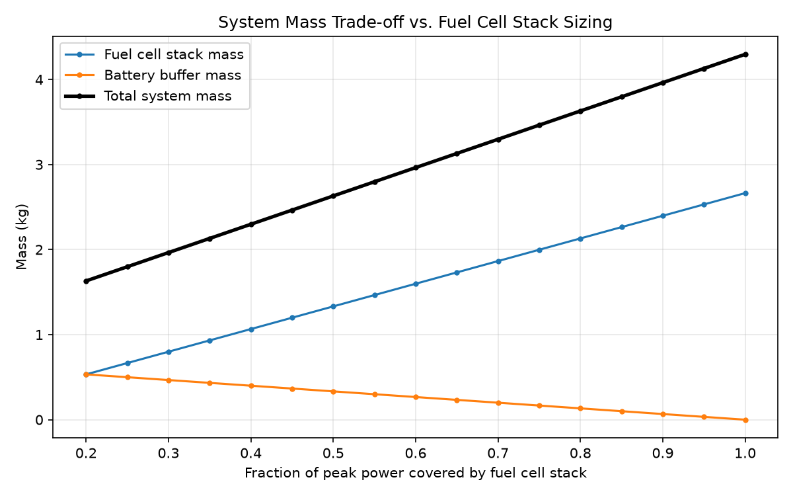
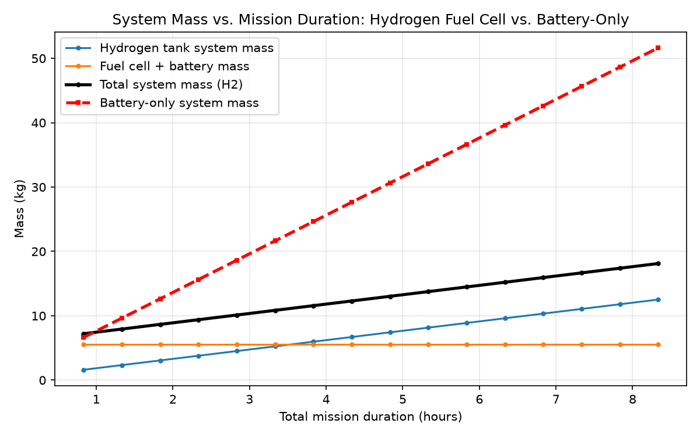
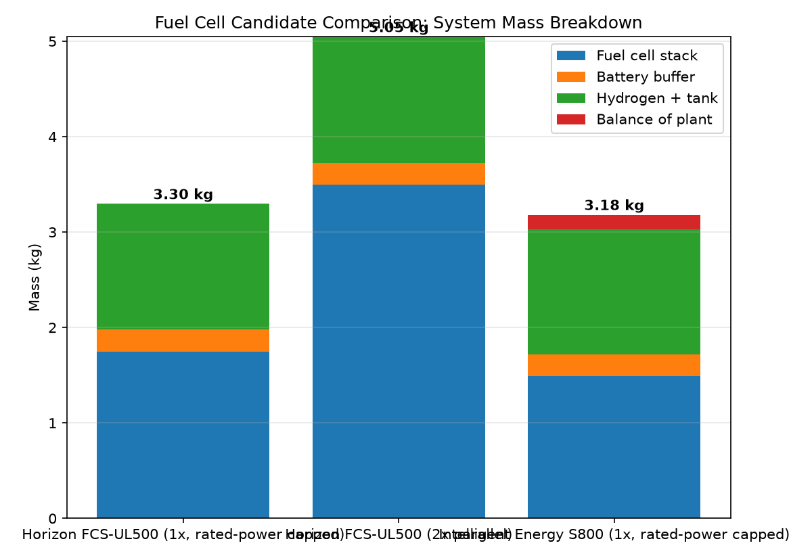

# Fuel Cell System Sizing Tool

A Python tool for sizing hydrogen fuel cell propulsion systems. Starting from a general-purpose sizing calculator, this repo also includes a real applied case study: sizing a fuel cell retrofit for an Evolonic (Fraunhofer IISB) VTOL UAV, using real datasheet specifications for every major component.

## Why this matters

Hydrogen fuel cells are often pitched as the answer to battery range limits in aviation, but *when* that's actually true depends on mission length, power profile, and real component specs — not just theory. This tool makes those trade-offs visible and quantifiable, and the case study below shows the full process applied to a real retrofit project, with every component traceable to a real manufacturer datasheet or product listing.

---

## Part 1: General Sizing Tool

### How it works

**1. Define a mission profile** (`src/mission_profile.py`)
A mission is modeled as a sequence of phases (e.g. takeoff, cruise, landing), each with a duration and power demand. From this, the tool derives total energy required and peak power demand.

**2. Size the system** (`src/fuel_cell_sizing.py`)
| Component | How it's sized |
|---|---|
| Fuel cell stack | Covers a chosen fraction of peak power continuously, OR capped at a real product's rated power |
| Battery buffer | Covers the remaining power gap during short peak-demand phases (e.g. takeoff) |
| Hydrogen tank | Sized by total mission energy — either a generic gravimetric-fraction estimate, or real cylinder products |
| Balance of plant | Power electronics, wiring, hoses — as a fraction of stack mass, or included in real product mass |

**3. Explore trade-offs** (`src/plot_results.py`)
Two general sweeps show how design choices affect total mass:


*A smaller fuel cell stack paired with a larger battery buffer can produce a lighter overall system, since batteries have much higher specific power (W/kg) than fuel cell stacks.*


*Fuel cell + battery mass stays flat regardless of mission duration, while a battery-only system's mass grows much faster — this is where hydrogen's energy density advantage shows up for longer missions.*

---

## Part 2: Real Case Study — Evolonic VTOL UAV Retrofit

This applies the tool to a real fuel cell retrofit project: adding a hydrogen fuel cell system to an existing battery-powered VTOL UAV, using measured flight data and real component datasheets throughout.

### The mission (measured, not estimated)

| Phase | Duration | Current draw | Power (at 22.2V) |
|---|---|---|---|
| Takeoff/hover | 1.25 min | 60 A | 1332 W |
| Cruise | 59.5 min | 10 A | 222 W |
| Landing | 1.0 min | 27.5 A | 611 W |
| **Total** | **~61.75 min** | — | **Peak: 1332 W, Energy: 247 Wh** |

Source: measured flight data from the existing battery-powered aircraft (62 min flight, 65.69 km, 249.4 Wh charging energy) — the model's 247 Wh result lines up closely with this, validating the mission model.

### Aircraft mass budget

- Airframe (with original battery): 9595 g
- Original battery: 1890 g → **airframe alone: 7705 g**
- Target maximum takeoff weight: 12,000 g (for a thrust-to-weight ratio of 1.7:1)
- **Mass budget for the entire new fuel cell system: 4000 g (4 kg)**

### Real components considered

**Fuel cell candidates:**

| Spec | [Horizon FCS-UL500](https://www.fuelcellstore.com/horizon-500-watt-pem-fuel-cell) | [Intelligent Energy S800](https://www.intelligent-energy.com/) | [Horizon UL-1000](https://www.fuelcellstore.com/horizon-1000-watt-pem-fuel-cell) |
|---|---|---|---|
| Rated power | 500 W | 800 W | 1000 W |
| Measured/rated mass | 1750 g (stack+housing+blowers+valves: 1332g, controller+cables+LCD+dissipation plate: 346g, tubes/screws/fittings/H2 connectors: 72g) | 1490 g (combined mass with cabling) | 3070 g (stack+housing+blowers+valves: 2266g, controller+cables+LCD+dissipation plate: 728g, tubes/screws/fittings/H2 connectors: 76g) |
| Specific power | 285.7 W/kg | 536.9 W/kg | 325.7 W/kg |
| System efficiency | 40% (datasheet minimum) | 48.5% (back-calculated from 50g H2/hr at 800W) | 40% (H-1000 datasheet, same family as UL500) |
| Output voltage range | 22.5–44.1 V | 25–50 V | 39–69 V |

**Hydrogen cylinder candidates ([X-Fiber by H2Planet](https://www.h2planet.eu/en/landing_page/xfiber_en)):**

| Spec | [X-Fiber S2](https://www.h2planet.eu/en/detail/xfiber_s2) | [X-Fiber S3](https://www.h2planet.eu/en/detail/xfiber_s3) |
|---|---|---|
| Volume | 2 L | 3 L |
| Empty mass | 1.3 kg | 1.6 kg |
| Max pressure | 300 bar | 300 bar |
| H2 capacity (at 300 bar, ~15°C, real-gas density ≈20.7 kg/m³) | 41.4 g | 62.1 g |
| Real gravimetric fraction (H2 mass ÷ total filled mass) | 3.1% | 3.7% |

The tool automatically prefers the larger S3 cylinder whenever it fits the mass budget (more hydrogen headroom for future missions), and only falls back to the smaller S2 when needed.

**Battery buffer candidates** — sized individually per configuration, so each fuel cell pairs with the smallest real battery that still meets its specific power and capacity requirement (minimizing dead weight rather than over-provisioning one battery everywhere):

| Spec | [CNHL Black Series V2.0 1300mAh 130C](https://www.racedayquads.com/products/cnhl-black-series-v2-0-1300mah-22-2v-130c-6s-lipo-battery-xt60) | [Gaoneng GNB 930mAh 120C](https://www.gaoneng.shop/products/gaoneng-gnb-6s-22.2v-930mah-120c-xt30-connector-lipo-battery) | [Gaoneng GNB 550mAh 80/160C](https://pyrodrone.com/products/gaoneng-gnb-22-2v-550mah-80-160c-6s-lipo-battery-jst-xt30) |
|---|---|---|---|
| Used for | Horizon UL500 (832W buffer) | Intelligent Energy S800 (532W buffer) | Horizon UL-1000 (332W buffer) |
| Configuration | 6S1P, 1300 mAh, 22.2V | 6S1P, 930 mAh, 22.2V | 6S1P, 550 mAh, 22.2V |
| Discharge rate | 130C (169 A max) | 120C (~112 A max) | 80C (44 A max) |
| Mass | 223 g | 148 g | 102 g |
| Connector | XT60 | XT30 | XT30 |

### Results: three configurations compared



| Configuration | Stack mass | Battery mass | Tank (cylinder used) | BoP mass | **Total mass** | vs. 4 kg budget |
|---|---|---|---|---|---|---|
| 1× Horizon UL500 (500W cap) | 1.750 kg | 0.223 kg | 1.619 kg (X-Fiber S3) | 0.000 kg | **3.592 kg** | Within, 0.408 kg margin |
| 1× Intelligent Energy S800 (800W cap) | 1.490 kg | 0.148 kg | 1.615 kg (X-Fiber S3) | 0.149 kg | **3.402 kg** | Within, 0.598 kg margin |
| 1× Horizon UL-1000 (1000W cap) | 3.070 kg | 0.102 kg | 1.319 kg (X-Fiber S2) | 0.000 kg | **4.491 kg** | Over by 0.491 kg |

*A fourth configuration — two Horizon UL500s in parallel to reach 1000W combined — was also modeled but excluded here: at 4.921 kg it was both the heaviest option and over budget, while adding real integration complexity (two separate stacks, controllers, and hydrogen plumbing) with no advantage over the single-unit alternatives.*

**Key findings:**
- **The Intelligent Energy S800 is the standout option**: lightest overall (3.402 kg) with the most margin (598g), and the only configuration where the larger 3L cylinder fits comfortably alongside everything else.
- **The Horizon UL-1000 doesn't fit this mission**, despite being a single, simple unit: at 3.07 kg, the stack itself is too heavy relative to what this mission actually needs, leaving no room for tank and battery within budget even with the smallest cylinder.
- Hydrogen tank mass is dominated by the cylinder's own structural weight, not the fuel: the mission only needs 15–19 g of H2, but even the smallest available cylinder (X-Fiber S2) weighs 1.3 kg empty. This system is **tank-mass-dominated**, not fuel-mass-dominated, at this mission's energy scale.
- Matching each configuration's battery buffer individually (rather than using one oversized battery everywhere) saves meaningful mass — e.g. the UL-1000 and 2x-UL500 configurations both only need a 102g battery, not a 227g one, since their larger/doubled stack already covers most of the peak power demand.

### Assumptions and what to validate further
- Hydrogen density at 300 bar (20.7 kg/m³) is a standard literature reference value — confirm against the exact cylinder manufacturer's fill charts if available.
- Balance-of-plant mass for the Horizon configurations is assumed to be fully captured in their measured total mass (including tubes/fittings) — worth double-checking once wiring/mounting hardware for the specific airframe integration is finalized.
- The battery buffer's 120-second sustain duration is a first-order estimate matching the combined takeoff+landing time; refine against the exact overlap between fuel cell response time and peak demand once real component response curves are available.
- Battery candidates were selected from commercial FPV/racing drone LiPo packs based on matching capacity and discharge-rate requirements — verify cycle life and thermal behavior are adequate for this application's duty cycle before committing to a specific part.

## Setup

```bash
python3 -m venv venv
source venv/bin/activate      # Linux/Mac
# venv\Scripts\Activate.ps1   # Windows PowerShell
pip install -r requirements.txt
```

Run the general sizing pipeline:
```bash
python3 src/mission_profile.py
python3 src/fuel_cell_sizing.py
python3 src/plot_results.py
```

Run the real case study comparison:
```bash
python3 src/compare_fuel_cells.py
```

## Project structure
```
fuel-cell-sizing-tool/
├── data/
│   └── mission_profiles.csv
├── src/
│   ├── mission_profile.py         # Mission power/energy profile
│   ├── fuel_cell_sizing.py        # Core sizing calculations
│   ├── plot_results.py            # General trade-off analysis & plots
│   ├── fuel_cell_profiles.py      # Real fuel cell datasheet specs (Horizon, IE)
│   ├── cylinder_profiles.py       # Real H2 cylinder specs (X-Fiber)
│   ├── battery_profiles.py        # Real battery specs (CNHL, Gaoneng)
│   └── compare_fuel_cells.py      # Real case study: 3-way comparison
├── notebooks/
│   ├── stack_fraction_tradeoff.png
│   ├── duration_tradeoff.png
│   └── fuel_cell_comparison.png
└── requirements.txt
```
